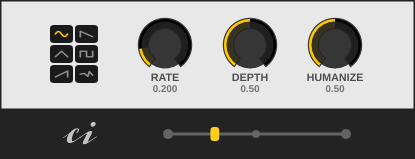

# Panacea
Panacea is an autopan audio effect plugin with the possibility of humanization, syncing to the host tempo and basic visualization for 64-bit Linux (VST2) and Windows (VST2, VST3). With its help, you can easily add more life and variety to your music.

Panacea is free and open source software released under the GPLv3 license.

Download the latest version here: https://github.com/consint/Panacea/releases/

## Which bugs are known
Under some circumstances the plugin does not work properly the first time it is loaded. The visualizer runs too far to the right and noise is generated. **Workaround: delete the plugin and load it again.**

## How to use
#### Sync
Switches between free mode and synchronization to the host tempo.

#### Bypass
Bypass the Plugin.

#### Rate
Set the speed of the LFO. In non-synced mode, the frequency can be set in Hz. In synced mode, you can choose between 32 time units - from 16/1 to 1/32 T.

#### Depth
Sets how strongly the LFO affects the panning. At zero it has no influence at all and at 1 it affects the entire stereo width. However, the depth is proportional to the panning. For example, if Pan is set to the far left and Depth is set to 1, the signal only moves between the far left and the center.

#### Phase
Shifts the phase of the LFO. For example, you can use this to shift the maximum deflection of the LFO from the on beat to the off beat. The phase can only be adjusted in synced mode.

#### Humanize
That's the special thing about this autopan plugin. Here you can set how strongly a random generator affects the rate of the LFO, sometimes slowing it down and sometimes speeding it up. In non-synced mode the random generator influences the LFO all the time and in synced mode periodically.

#### Waveform
The waveform of the LFO can be selected with the large waveform knob in the center. Click on one of the waveform images to jump directly to it.

#### Pan
The pan control is used to shift the signal in the stereo field.

#### Gain
Adjusts the output volume of the plugin in dB.

## How to install
### Linux
1. Install Csound. It should be in your package manager or look here: https://csound.com/download.html
2. Copy the complete Panacea folder into your VST directory. This can be .vst in your home folder, for example. In Ardour you have to add the folder to the Linux VST2 path list under Settings -> Plugins -> VST so that Ardour looks for VST2 plugins there. It is important to copy the entire Panacea folder into your VST directory. If the file "panacea.csd" or the folder "img" is missing, the plugin will not work properly.

### Windows
1. Install Csound from https://csound.com/download.html
2. Copy either the complete VST2 Panacea folder into your VST2 directory C:\Program Files\Steinberg\VstPlugins. Or copy the complete VST3 Panacea folder into your VST3 directory C:\Program Files\Common Files\VST3. It is important to copy the entire Panacea folder. If the file "panacea.csd" or the folder "img" is missing, the plugin will not work properly.

## How it was made
Panacea was created with Cabbage and CSound. [Cabbage](https://cabbageaudio.com/) is a framework for audio software development using the Csound audio synthesis language. [Csound](https://csound.com/) is a sound and music computing system that contains a complete software package for making computer music. Both are open source.
