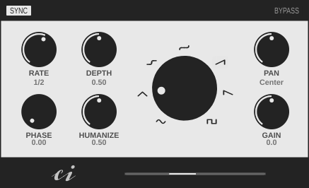

# Panacea
Panacea is an autopan audio effect plugin with the possibility of humanization, syncing to the host tempo and basic visualization. With its help, you can easily add more life and variety to your music.

Panacea is free and open source software released under the GPLv3 license.

